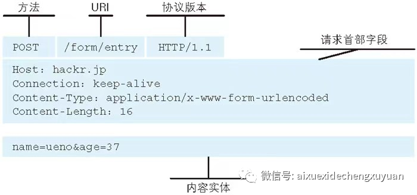

# 了解Web及网络基础

## 使用HTTP协议访问Web

Web使用一种名为HTTP（超文本传输协议）的协议作为规范，完成从客户端到服务器等一系列运作流程。可以说，Web是建立在HTTP协议上通信的。

## 诞生

- 最初的设想的基本概念是：借助多文档之间相互关联形成的超文本（HyperText），连成可相互参阅的WWW(World Wide Web，万维网)。
- 现在已经提出了3项WWW构建技术，分别是：把SGML（Standard Generalized Markup Language， 通用标记语言）作为页面的文本标记语言的HTML（HyperText Markup Language，超文本标记语言）；作为文档传递协议的HTTP；指定文档所在地址的URL（Uniform Resource Locator， 统一资源定位符）。

## 网络基础TCP/IP

通常使用的网络（包括互联网）是在TCP/IP协议族的基础上运作的。而HTTP属于它内部的一个子集。
TCP/IP协议族按层次分为以下四层：应用层，传输层，网络层，数据链路层。

应用层：应用层决定了向用户应用提供服务时的通信活动，TCP/IP协议族内预存了各类通用的应用服务。比如，FTP（文件传输协议）和DNS（域名系统）服务就是其中两类。其中HTTP也是属于这层。

传输层：传输层对上层应用层，提供处于网络连接中的两台计算机之间的数据传输。有两个重要不同协议：TCP（传输控制协议）和UDP（用户数据报协议）。

网络层：网络层用来处理在网络上流动的数据包。该层规定了通过怎么样的路径到达目的计算机，并把数据传送给对方。在于对方计算机之间通过多台计算机或网络设备进行传输时，网络层所起的作用就是在众多的选项内选择一条传输线路。

链路层：用来处理连接网络的硬件部分。硬件上的范畴均在链路层的作用范围内。（控制操作系统、硬件的设备光驱动、NIC。网卡等）

## 与HTTP密切的协议：IP,TCP,DNS

### 负责传输的IP协议

IP ( Internet Protocol)网际协议位于网络层。IP协议的作用是把各种数据包传送给对方。为了确保传送，要用到IP地址（节点被分配的地址），MAC地址（设备的物理地址）。用ARP（地址解析协议）。

### 确保可靠性的TCP协议

TCP位于传输层，提供可靠的字节流服务。TCP协议为了更容易传送大数据把数据分割，而且TCP协议能够确认数据最终是否送达到对方。

### DNS负责域名解析

DNS(DomainNameSystem)服务是和HTTP协议一样位于应用层的协议。它提供域名到IP地址之间的解析服务。

### URI,URL

- URI：统一资源标识符

- URL：统一资源定位符 URL是URI的子集

  （我的理解是， URI是一个资源的按特定规则取的“名字”，而URL是一个资源的地址，一个资源可以直接使用地址作为名字）

# 简单的HTTP协议

HTTP协议用于客户端和服务器之间的通信。通过请求和响应的交换达成通信。

## HTTP是不保存状态的协议

HTTP 是无状态的协议，它不对之前发生过的请求和响应的状态进行管理。

HTTP/1.1虽然是无状态协议，但为了实现期望的保持状态功能，于是引入了Cookie 技术。有了Cookie 再用HTTP协议通信，就可以管理状态了。

##  请求URI定位资源

## 告知服务器意图的HTTP方法

**GET**：获取资源
**POST**：传输实体主体

**PUT**：传输文件

**HEAD**：获得报文部首（不返回报文主体部分，用于确认URI的有效性及资源更新的日期时间等）

**DELETE**：删除文件（DELETE方法用来删除文件，是与PUT相反的方法。DELETE方法按请求URI删除指定的资源。但是，HTTP/1.1 的DELETE方法本身和PUT方法一样不带验证机制，所以一般的Web网站也不使用DELETE方法。当配合Web应用程序的验证机制，或遵守REST标准时还是有可能会开放使用的。）

**OPTIONS**：询问支持的方法
**TRACE**：追踪路径
**CONNECT**:要求用隧道协议连接代理.

## 使用方法下达命令

## 持久连接节省通信量

**持久连接：**只要任意一端没有明确提出断开连接，则保持 TCP 连接状态。

**管线化：**可以同时并行发送多个请求，不需要一个接一个地等待响应了。

## **使用 Cookie 的状态管理**

通过在请求和响应报文中写入 Cookie 信息来控制客户端的状态。

cookie会根据从服务器端发送的响应报文中一个叫做set-cookie的首部字段信息，通知客户端保存cookie，下次再发送请求，客户端会自动在请求报文中 添加cookie。

# HTTP报文

用于HTTP协议交互的信息被称为HTTP报文。

## 报文主体和实体主体的差异

报文（message）：是 HTTP 通信中的基本单位，由 8 位组字节流（octet sequence，其中 octet 为 8 个比特）组成，通过 HTTP 通信传输。

实体（entity）：作为请求或响应的有效载荷数据（补充项）被传输，其内容由实体首部和实体主体组成。

HTTP 报文的主体用于传输请求或响应的实体主体。

## **编码提升传输速率**

**压缩传输的内容编码**

**分割发送的分块传输编码**

## 发送多种数据的多部分对象集合？？？

## 获取部分内容的范围请求

## 内容协商返回最合适的内容

内容协商机制是指客户端和服务器端就响应的资源内容进行交涉，然后提供给客户端最为适合的资源。内容协商会以响应资源的语言、字符集、编码方式等作为判断的基准。包含在请求报文中的某些首部字段(如下)就是判断的基准。

- Accept
- Accept-Charset
- Accept-Encoding
- Accept-Language
- Content-Language

## **返回结果的 HTTP 状态码**

### 状态码告知从服务器端返回的请求结果

1XX：Informational（信息性状态码），接收的请求正在处理

2XX：Success（成功状态码），请求正常处理完毕

1） 200 OK：表示从客户端发来的请求在服务器端被正常处理了。

2）204 No Content：表示服务器接收的请求已成功处理，但在返回的响应报文中不含实体的主体部分，浏览器显示的页面不发生更新。

3）206 Partial Content：表示客户端进行了范围请求，而服务器成功执行了这部分的 GET 请求，响应报文中包含由 Content-Range 指定范围的实体内容。

3XX：Redirection（重定向状态码），需要进行附加操作以完成请求

1）301 Moved Permanently：永久性重定向，表示请求的资源已被分配了新的 URI，以后应使用资源现在所指的 URI。也就是说，如果已经把资源对应的 URI 保存为书签了，这时应该按 Location 首部字段提示的 URI 重新保存。

2）302 Found：临时性重定向，表示请求的资源已被分配了新的 URI，希望用户（本次）能使用新的 URI 访问。

3）303 See Other：表示由于请求对应的资源存在着另一个 URI，应使用 GET 方法定向获取请求的资源。

4）304 Not Modified：表示客户端发送附带条件的请求时，服务器端允许请求访问资源，但因发生请求未满足条件的情况后，直接返回 304 Not Modified（服务器端资源未改变，可直接使用客户端未过期的缓存）。

5）307 Temporary Redirect：临时重定向，307 会遵照浏览器标准，不会从 POST 变成 GET。但是对于处理响应时的行为，每种浏览器有可能出现不同的情况。

4XX：Client Error（客户端错误状态码），服务器无法处理请求

1）400 Bad Request：表示请求报文中存在语法错误。当错误发生时，需修改请求的内容后再次发送请求。另外，浏览器会像 200 OK 一样对待该状态码。

2）401 Unauthorized：表示发送的请求需要有通过 HTTP 认证（BASIC 认证、DIGEST 认证）的认证信息。另外若之前已进行过 1 次请求，则表示用户认证失败。

3）403 Forbidden：表明对请求资源的访问被服务器拒绝了。

4）404 Not Found：表明服务器上无法找到请求的资源，也可以在服务器端拒绝请求且不想说明理由时使用。

5XX：Server Error（服务器错误状态码），服务器处理请求出错

1）500 Internal Server Error：表明服务器端在执行请求时发生了错误，也可能是 Web 应用存在的 bug 或某些临时的故障。

2）503 Service Unavailable：表明服务器暂时处于超负载或正在进行停机维护，现在无法处理请求。

# **通信数据转发程序**

## **代理**

代理服务器的基本行为就是接收客户端发送的请求后转发给其他服务器。代理不改变请求 URI，会直接发送给前方持有资源的目标服务器。持有资源实体的服务器被称为源服务器，从源服务器返回的响应经过代理服务器后再传给客户端。

1）缓存代理

代理转发响应时，缓存代理（Caching Proxy）会预先将资源的副本（缓存）保存在代理服务器上。当代理再次接收到对相同资源的请求时，就可以不从源服务器那里获取资源，而是将之前缓存的资源作为响应返回。

2）透明代理

转发请求或响应时，不对报文做任何加工的代理类型被称为透明代理（Transparent Proxy）。反之，对报文内容进行加工的代理被称为非透明代理。

## **网关**

网关能使通信线路上的服务器提供非 HTTP 协议服务。利用网关能提高通信的安全性，因为可以在客户端与网关之间的通信线路上加密以确保连接的安全。

**隧道**

隧道可按要求建立起一条与其他服务器的通信线路，使用 SSL 等加密手段进行通信。隧道的目的是确保客户端能与服务器进行安全的通信，HTTP 请求保持原样中转给之后的服务器。隧道会在通信双方断开连接时结束。

# HTTP首部

HTTP首部字段传递重要信息，由首部字段名+“：”+字段值构成，字段值对应单个HTTP首部字段可以有多个值。

首部字段可以分为端到端首部（即到最终目标接收）和逐跳首部（只对单次转发有效）。

## 通用首部字段（General Header Fields）

请求报文和响应报文双方都会使用的首部。

### Cache-Control：控制缓存的行为

1）缓存请求指令

no-cache：强制向源服务器再次验证

no-store：不缓存请求或响应的任何内容

max-age = [秒]：响应的最大Age值

max-stale( = [秒])：接收已过期的响应

min-fresh = [秒]：期望在指定时间内的响应仍有效

no-transform：代理不可更改媒体类型

only-if-cached：从缓存获取资源

cache-extension：新指令标记（token）

2）缓存响应指令

public：可向任意方提供响应的缓存

private：仅向特定用户返回响应

no-cache：缓存前必须先确认其有效性

no-store：不缓存请求或响应的任何内容

no-transform：代理不可更改媒体类型

must-revalidate：可缓存但必须再向源服务器进行确认

proxy-revalidate：要求中间缓存服务器对缓存的响应有效性再进行确认

max-age = [秒]：响应的最大Age值

s-maxage = [秒]：公共缓存服务器响应的最大Age值

cache-extension：新指令标记（token）

### **Connection：逐跳首部、连接的管理**

1）控制代理不再转发的首部字段

2）管理持久连接

### **Trailer：报文末端的首部一览**

Trailer 会事先说明在报文主体后记录了哪些首部字段。该首部字段可应用在 HTTP/1.1 版本分块传输编码时。

### **Upgrade：升级为其他协议**

Upgrade 用于检测 HTTP 协议及其他协议是否可使用更高的版本进行通信，其参数值可以用来指定一个完全不同的通信协议。

### Warning：错误通知

HTTP/1.1 的 Warning 首部是从 HTTP/1.0 的响应首部（Retry-After）演变过来的，该首部通常会告知用户一些与缓存相关的问题的警告。

HTTP/1.1 警告码：

110：Response is stale（响应已过期），代理返回已过期的资源

111：Revalidation failed（再验证失败），代理再验证资源有效性时失败（服务器无法到达等原因）

112：Disconnection operation（断开连接操作），代理与互联网连接被故意切断

113：Heuristic expiration（试探性过期），响应的使用期超过24小时（有效缓存的设定时间大于24小时的情况下）

199：Miscellaneous warning（杂项警告），任意的警告内容

214：Transformation applied（使用了转换），代理对内容编码或媒体类型等执行了某些处理时

299：Miscellaneous persistent warning（持久杂项警告），任意的警告内容
***请求首部字段**（Request Header Fields）*

从客户端往服务器端发送请求报文中所使用的字段，用于补充请求的附加信息、客户端信息、对响应内容相关的优先级等内容。

## 请求首部字段（Request Header Fields）

从客户端往服务器端发送请求报文中所使用的字段，用于补充请求的附加信息、客户端信息、对响应内容相关的优先级等内容。

## ***响应首部字段（Response Header Fields）***

从服务器端向客户端返回响应报文时使用的首部，补充了响应的附加内容，也会要求客户端附加额外的内容信息。

## ***实体首部字段（Entity Header Fields）***

针对请求报文和响应报文的实体部分使用的首部，补充了资源内容更新时间等与实体有关的信息。

## **为 Cookie 服务的首部字段**

# **确保 Web 安全的 HTTPS**

## **HTTP 的缺点**

### **通信使用明文（不加密），内容可能会被窃听**

互联网上的任何角落都存在通信内容被窃听的风险：

加密处理防止被窃听，通常有通信加密：服务器与客户端建立安全线路之后再通信；内容本身加密。

### **不验证通信方的身份，有可能遭遇伪装**

1）无法确定请求发送至目标的 Web 服务器是否是按真实意图返回响应的那台服务器，有可能是已伪装的 Web 服务器。

2）无法确定响应返回到的客户端是否是按真实意图接收响应的那个客户端，有可能是已伪装的客户端。

3）无法确定正在通信的对方是否具备访问权限，因为某些 Web 服务器上保存着重要的信息，只想发给特定用户通信的权限。

4）无法判定请求是来自何方、出自谁手，即使是无意义的请求也会照单全收。

5）无法阻止海量请求下的 DoS 攻击（Denial of Service，拒绝服务攻击）。

### **无法证明报文的完整性，有可能已遭篡改**

没有任何办法确认，发出的请求 / 响应和接收到的请求 / 响应是前后相同的。

## HTTP+加密+认证+完整性保护=HTTPS

###  **HTTPS 是身披 SSL 外壳的 HTTP**

HTTPS 并非是应用层的一种新协议，而是 HTTP 通信接口部分用 SSL 和 TLS 协议代替而已。

SSL采用一种叫做公开密钥加密（Public-key cryptography）的加密处理方式。

HTTPS采用混合加密机制。

### 证明公开密钥正确性的证书

## **HTTPS 通信**

# **确认访问用户身份的认证**

HTTP使用的认证方式如下：

## **BASIC 认证（基本认证）**

## **DIGEST 认证（摘要认证）**

质询/响应方式

## SSL认证

为达到 SSL 客户端认证的目的，需要事先将客户端证书分发给客户端，且客户端必须安装此证书。

SSL 客户端认证采用双因素认证，第一个认证因素的 SSL 客户端证书用来认证客户端计算机，另一个认证因素的密码则用来确定这是用户本人的行为。

## **FormBase 认证（基于表单认证）**

基于表单的认证方法并不是在 HTTP 协议中定义的，客户端会向服务器上的 Web 应用程序发送登录信息（Credential），按登录信息的验证结果认证，一般会使用 Cookie 来管理 Session（会话）。

# 构建Web内容的技术

**HTML**(超文本标记语言)：是为了发送Web上的超文本而开发的标记语言，

**超文本**：是一种文档系统，可将文档中任意位置的信息与其他信息建立关联，即超链接文本。

设计应用 CSS，可以指定如何展现HTML内的各种元素。

动态HTML是指使用客户端脚本语言（JavaScript）将静态的HTML内容变成动态技术的总称。利用DOM（文档对象模型）可以指定欲发生动态变化的HTML元素。

# Web的攻击技术

Web应用的攻击模式有以下两种：

**主动攻击**：指攻击者通过直接访问 Web 应用，把攻击代码传入的攻击模式（ SQL 注入攻击、OS命令注入攻击）

**被动攻击**：利用圈套策略执行攻击代码的攻击模式（跨站脚本攻击、跨站点请求伪造）