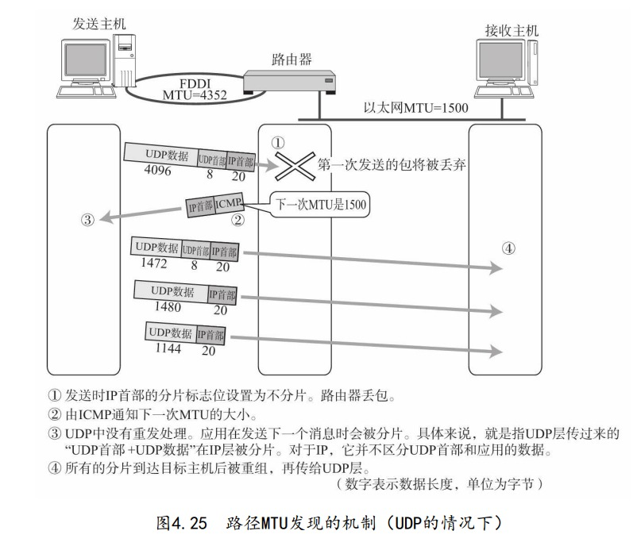
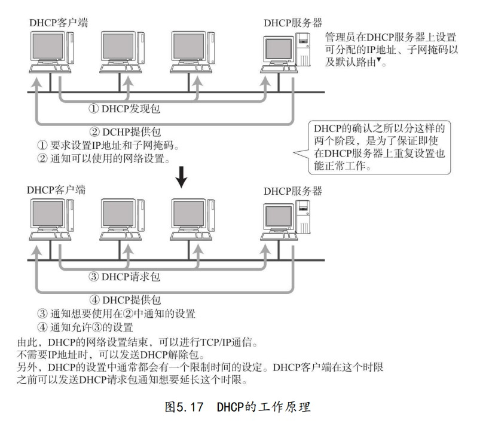
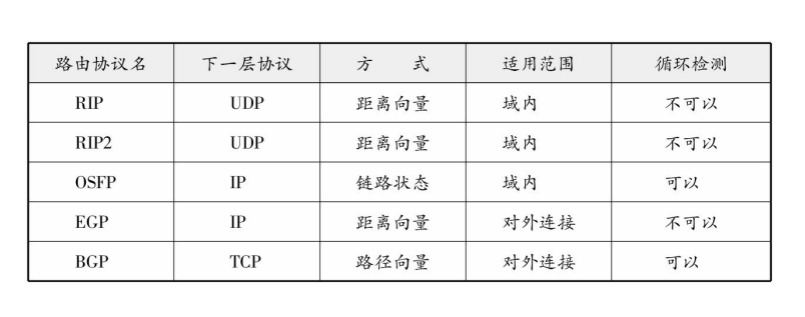
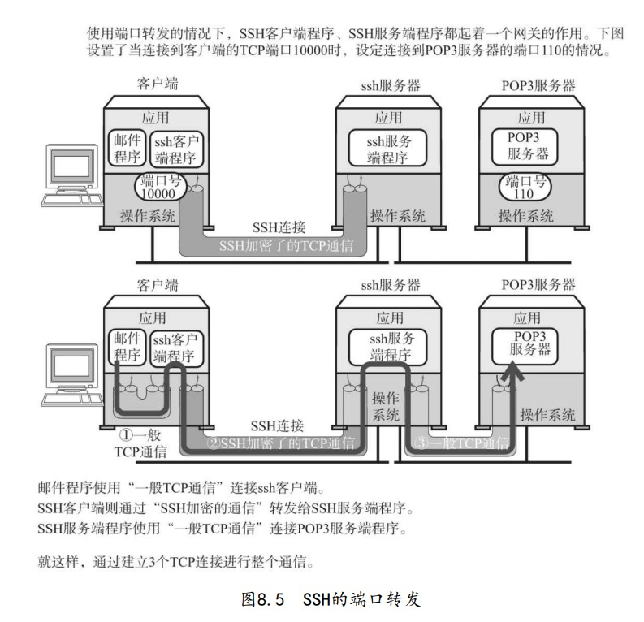
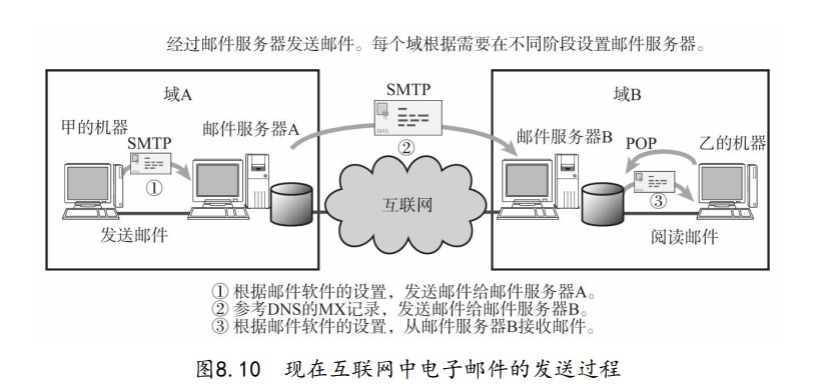

# 网络基础

连接异构型计算机的网络通信技术就是互联网。

互联网有许多独立发展的网络通信技术融合而成，将所有不断融合的是TCP/IP。

上下层交互遵循的约定：接口

同一层交互遵循的约定：协议

应用层写入的数据会经由表示层格式编码、再由会话层标记发送顺序后发送出去，真正的传输是传输层以下的工作。

保证数据可靠传输是传输层另一个工作。

网络层负责数据发送至最终目的，数据链路层负责每一个区间的通信。

传送方式的分类：

1. 面向有连接与面向无连接型

   传输前建立通信链路，无需确认接收端是否存在，随时发送

2. 电路交换与分组交换

   3.根据接收端数量分类（单播Unicast、广播Broadcast、任播Anycast)

网络的构成要素：

# TCP/IP基础

## 互联网与TCP/IP的关系：

互联网进行通信时，需要相应的网络协议，TCP/IP原本就是为使用互联网而开发定制的协议族。因此，互联网协议就是TCP/IP，TCP/IP 就是互联网的协议。

OSI参考模型注重：通信协议必要的功能

TCP/IP注重：在计算机上实现协议应该开发哪种程序

1. 硬件（物理层）

   最底层负责数据传输的硬件。这种硬件相当于以太网或电话线路等物理层设备。

2. 网络接口层（数据链路层）

   计算机的外围附加设备或网卡，不是直接插到电脑上或电脑的扩展槽上就能马上使用的，还需要相应驱动程序的支持。

3. 互联网层（网络层）

   互联网层使用IP协议，它相当于OSI模型中的第3层网络层。IP协议基于IP地址转发分包数据。

   - IP：跨越网络传送数据包，使整个互联网都能收到数据的协议。
   - ICMP：IP数据包在发生途中发生异常导致无法到达对端目标地址时，需要给发送端发送一个发送异常的通知。
   - ARP：从分组数据包的IP地址中解析出物理地址（MAC地址）的一种协议。

​	4.传输层

​		传输层的主要功能就是能够让应用程序之间实现通信。计算机内部，通		常同一时间运行着多个程序。因此，必须分清是那些程序与那些程序在		进行通信。识别这些应用程序的是端口号。TCP和UDP是最典型的传输		层协议。

​	5.应用层（会话层以上）

​		eg：

​		浏览器与服务器之间的通信协议HTTP，传输的数据的主要格式HTML。

​		WWW：万维网

​		E-Mail

​		文件传输（FTP）

​		远程登录（TELNET与SSH）

​		网络管理（SNMP）

## 通信实例：发送邮件

## 		包分析

经过以太网的数据链路是大致流程，依次添加了以太网首部、IP包首部、TCP首部、以及自己的包首部和数据，包的最后添加了包尾。每个包首部至少两种信息：发送端、接收端地址，上一层协议类型。

## 包接收处理

以太网找到MAC地址判断是否发给自己，不是则丢弃。判断协议类型交给上层，无法识别则丢弃。

IP模块根据IP地址匹配，有可能要借助路由器的路由表转发。

TCP模块首先计算校验和，判断数据是否完好，然后检查是否按序号接收数据，再检查端口号确定应用程序。接收完毕还会发送确认回执。

应用程序接收数据并发送相关回执。

# 数据链路

## 基础

数据链路，指OSI参考模型中的数据链路层，有时也指以太网、无线局域网等通信手段。

TCP/IP中对于OSI参考模型的数据链路层及以下部分（物理层）未作定义。因为TCP/IP以这两这两层的功能是透明的为前提。

数据链路层的协议定义了通过通信媒介互联的设备之间传输的规范。通信媒介包括双绞线、同轴电缆、光纤、电波以及红外线等介质。此外，各个设备之间有时也会通过交换机、网桥、中继器等中转数据。

众所周知，计算机以二进制0、1来表示信息，**然而实际的通信媒介之间处理的却是电压的高低、光的闪灭以及电波的强弱等信号。把这些信号与二进制0、1进行转换正是物理层的责任。**

数据链路的段根据使用者不同，含义不同。eg:

## 数据链路相关知识

### MAC地址

MAC地址用于识别数据链路中互连的节点，以太网、无线LAN、蓝牙等设备中也是用相同规格的MAC地址。

MAC地址长48比特，结构如下。在使用网卡的情况下，MAC地址一般会被烧入到ROM中。因此，任何一个网卡的MAC地址都是唯一的，在全世界都不会有重复

### 共享介质型网络

多个设备共享一个通信介质的网络。两种介质访问控制方式：争用方式（CSMA,CSMA/CD）、令牌传递方式。

### 非共享介质网络

对介质采取专用的传输控制方式，网络中每个站直连交换机，交换机负责转发数据。

### 根据MAC地址转发

用到以太网交换机即持有多个端口的网桥。自学习产生转发表eg:

交换机转发方式：存储转发，检查数据帧末尾校验和发送

直通转发。

### 相应的环路检测技术 ？

生成树方式、源路由法

### VLAN

进行网络管理的时候，时常会遇到分散网络负载、变换部署网络设备的位置等情况。而有时管理员在做这些操作时，不得不修改网络的拓扑结构，这也就意味着必须进行硬件线路的改造。然而，如果采用带有VLAN技术的网桥，就不用实际修改网络布线，只需修改网络的结构即可

TAG VLAN中对每个网段都用一个VLAN ID的标签进行唯一标识。在交换机中传输帧时，在以太网首部加入这个VID标签，根据这个值决定将数据帧发送给哪个网段

## 以太网

连接形式过去：多台终端使用同一跟同轴电缆的共享介质连接方式；

现在：终端与交换机之间独占电缆

以太网因通信电缆不同、通信速度不同，衍生众多类型。

以太网帧前端有一个叫做前导码（Preamble）的部分，它由0、1数 字交替组合而成，表示一个以太网帧的开始，也是对端网卡能够确保与 其同步的标志。前导码末尾是一个叫做SFD的域，它的值是“11”。在这个域之后就是以太网帧的 本体。前导码与SFD合起来占8个字节

## 无线通信

无线PAN,无线LAN、无线MAN、无线RAN等

IEEE802.11定义了无线LAN协议中物理层与数据链路层的一部分，介质访问控制使用CSMA/CA

## PPP

点对点，位于数据链路层

以太网网使用同轴电缆或双 绞线电缆，它可以决定其中的0、1该被解释为何种电子信号。与之相 比，PPP属于纯粹的数据链路层，与物理层没有任何关系。换句话说， 仅有PPP无法实现通信，还需要有物理层的支持。

在开始进行数据传输前，要先建立一个PPP级的连接。

不依赖上层的LCP协议；是依赖上层的NCP协议。如果上层为IP，此时的NCP也叫做IPCP。LCP主要负责建立和断开连接、设置最大接收单元、设置验证协议以及设置是否 进行通信质量的监控。而IPCP则负责IP地址设置以及是否进行TCP/IP首部压缩等设

### PPP帧格式

## 总览

## 公共网络

### VPN

虚拟专用网络（VPN）用于连接距离较远的地域。这种服务包括 IP-VPN（在IP网络（互联网）上建立VPN）和广域以太网。

# IP协议

网际协议，负责将数据包发送给最终目的计算机。作用在网络层。网络层的下一层——数据链路层的主要作用是在互连同一种数据链路的节点之间进行包传递。而一旦跨越多种数据链路，就需要借助网络层。网络层可以跨越不同的数据链路，即使是在不同的数据链路上也能实现两端节点之间的数据包传输。

## IP基础

三大作用：IP寻址、路由、IP分包与组包

在网桥或交换集线器等物理层或数据链路层数据包转发设备 中，不需要设置IP地址，因为这些设备只负责将IP包 转化为0、1比特流转发或对数据链路帧的数据部分进行转发，而不需要 应对IP协议。

以太网等数据链路中使用MAC地址传输数据帧。此时的一跳是 指从源MAC地址到目标MAC地址之间传输帧的区间。也就是说它是 主机或路由器网卡不经其他路由器而能直接到达的相邻主机或路由器 网卡之间的一个区间。在一跳的这个区间内，电缆可以通过网桥或交 换集线器相连，不会通过路由器或网关相连。

所有主机都维护着一张路由控制表。该表记录IP数据在下一步应该发给哪个路由器。IP 包将根据这个路由表在各个数据链路上传输。

IP抽象了下层的数据链路，忽略不同数据链路的差异,IP属于面向无连接类型。

## IP地址

网络标识在数据链路的不同段配置不同值。

同一网段内主机网络标识一致，主机标识不同。

广播地址：主机号全为1

## IP多播

广播无法穿透路由，多播既可以穿透路由，又可以实现只给那些必要的组发送包。

多播使用D类地址。前4位是1110。剩下28位可以成为多播的组编号。

## 子网掩码

网络号全1，主机号全0.CIDR无类型域间选路，合并多个IP地址的网络号

## 全局地址和私有地址

对于那些没有连接互联网的独立网络中的主机，只要保证在这 个网络内地址唯一，可以不用考虑互联网即可配置相应的IP地址。

互换私有地址和全局IP的NAT技术应用。

## IP地址与路由控制

## 路由控制表聚合

## IP报文分片、重组

路由器分片

### 路径MTU发现

指从发送端主机到接收端主机之间不再需要分片时的最大MTU大小。即路径中存在的数据链路的最小MTU。

初始将IP首部中分片禁止标志位设置为1。路由器不分片，丢弃。

TCP会重发，所以是TCP负责分片；UDP不会重发，所以是IP负责分片。

## IPv6

128位，采用：分隔。一个IP地址中可以出现一个省略多个0的：：。

### 全局单播地址、链路本地地址

指世界上唯一的一个地址

指在同一个数据链路内唯一的地址，不经过路由器，在同一个链路中通信。

指不进行互联网通信时的地址。

## IPv4  IPv6首部

# IP协议相关技术

## DNS

域名是分层组织的，可以在每个主机名之后加上组织机构的域名。

进行DNS查询的机器叫做DNS解析器，一个解析器至少要注册一个以上域名服务器的IP地址。

## ARP

借助ARP请求和ARP响应两种类型的包确定MAC地址。有ARP缓存表

RARP反之。需加设一台RARP服务器，保存MAC地址及其IP地址，将此设备接入网络。

## ICMP

ICMP的主要功能包括，确认IP包是否成功送达目标地址，通知在 发送过程当中IP包被废弃的具体原因，改善网络设置等。

ICMP的消息大致可以分为两类：一类是通知出错原因的错误消 息，另一类是用于诊断的查询消息。ICMP的这种通知消息会使用IP进行发送

重定向消息的粒子：

IPv6使用ICMPv6,融合了IPv4的ARP，ICMP重定向，ICMP路由器选择消息等功能。

## DHCP

自动设置IP地址、统一管理IP地址分配。

为了检查所要分配的IP地址以及已经分配了的IP地址是否可用， DHCP服务器或DHCP客户端必须具备以下功能：

DHCP服务器 

在分配IP地址前发送ICMP回送请求包，确认没有返回应答。（此IP地址尚未使用）

DHCP客户端

针对从DHCP那里获得的IP地址发送ARP请求包，确认没有返回应答。（IP地址还没有配对给某个设备）

有了DHCP中继代理以后，对不同网 段的IP地址分配也可以由一个DHCP服务器统一进行管理和运维。只需在每 个网段设置一个DHCP中继代理即可。

## NAT

## 隧道（在某协议的包作为数据加上一层某协议）

## IP多播相关技术

IP多播，确认接收端存在重要。是IGMP（MLD）的功能。

IGMP（MLD）的两大功能：

向路由器表明想要接收多播消息（并通知想接收多播的地址）。

向交换集线器通知想要接收多播的地址。

## IP任播

为提供同一种服务的服务器分配同一个IP地址，与最近的服务器通信。

## 通信质量控制、显式拥塞通知

拥塞检查 在网络层进行，而拥塞通知则在传输层进行，这两层的互相协助实现了 拥塞通知的功能。

# TCP UDP

根据端口号就可以识别在传输层上一层的应用层中 所要进行处理的具体程序（一个程序可以使用多个端口。） 。传输协议的数据将被传递给HTTP、TELNET以及 FTP等应用层协议。使用TCP或UDP通信时，又会广泛使用到套接字（socket）的 API。

TCP/IP或UDP/IP通信中通常采用5个信息来识别一个通 信。它们是“源IP地址”、“目标IP地址”、“协议号”、“源端口号”、“目标 端口号”。只要其中某一项不同，则被认为是其他通信。

## UDP

UDP不提供复杂的控制机制，利用IP提供面向无连接的通信服务。面向无连接，它可以随时发送数据。

## TCP

对传输、发送、通信进行控制的协议。

TCP通过检验和、序列号、确认应答、重发控制、连接管理以及窗 口控制等机制实现可靠性传输。

### 通过序列号与确认应答提高可靠性

确认应答ACK；序列号：发送数据的字节编址

需要引入机制识别是否已经接收数据，判断是否需要接收。

### 重发超时需确定

多次重发后终止。

### 连接管理

### 以段为单位发送数据

### 窗口控制提速

窗口大小就是指无需等待确认应答而可以继续发送数据的最大值。

这个机制实现了使用大量的缓冲区（缓冲区（Buffer）在此处表示 临时保存收发数据的场所。通常是在计算机内存中开辟的一部分空 间。） ，通过对多个段同时进行确认应答的功能。

### 窗口控制与重发控制

接收应答缺失可以通过后续的确认应答避免得知数据接收到了，不用重发。

而数据缺失，会针对当前未知收到的数据返回确认应答。不断地返回。

### 流控制

TCP提供一种机制可以让发送端根据接 收端的实际接收能力控制发送的数据量。这就是所谓的流控制。它的具 体操作是，接收端主机向发送端主机通知自己可以接收数据的大小，于 是发送端会发送不超过这个限度的数据。

### 拥塞控制

计算机网络都处在一个共享的环境。TCP在通信一开始时就会通过一个叫做慢 启动的算法得出的数值，对发送数据量进行控制。

定义了一个叫做“拥 塞窗口”的概念。于是在慢启动的时候，将这个拥塞窗口的大小设置为1 个数据段（1MSS）发送数据，之后每收到一 次确认应答（ACK），拥塞窗口的值就加1。在发送数据包时，将拥塞 窗口的大小与接收端主机通知的窗口大小做比较，然后按照它们当中较 小那个值，发送比其还要小的数据量。

超时重发机制：阈值设置为超时窗口一半；

重复确认应答引发的重发机制：慢启动阀值的大小被设置 为当时窗口大小的一半，然后将窗口的大小设置为该慢启动阀 值+3个数据段的大小。

### 其他

延迟确认应答、捎带应答

## 首部格式

# 路由协议

## 分类

静态路由、动态路由

根据路由协议交换路由信息自动生成路由控制表。

根据路由控制范围路由协议分为IGP（内部网关协议）与EGP（域间网关协议）两类。

根据EGP在区域网络之间（或ISP之间）进行路 由选择，也可以根据IGP在区域网络内部（或ISP内部）进行主机识别。

IGP中还可以使用RIP（路由信息协议）、RIP2、OSPF（开放式最短路径优先） 等众多协议。与之相对，EGP使用的是BGP（边界网关协议）协议。

## 路由算法

### 距离向量算法

距离向量算法（DV）是指根据距离和方向决定目标网络或目标主机 位置的一种方法。路由器之间可以互换目标网络的方向及其距离的相关信息，并以这 些信息为基础制作路由控制表。

### 链路状态算法

链路状态算法是路由器在了解网络整体连接状态的基础上生成路由 控制表的一种方法。该方法中，每个路由器必须保持同样的信息才能进 行正确的路由选择。只要 每个路由器尽快地与其他路由器同步路由信息，就可以使路由信息达到一 个稳定的状态。

## 协议

### RIP

广播路由控制信息，多次未收到连接就会断开。

根据距离向量确定路由

使用子网掩码时的RIP处理

从接口的IP地址对应分类得出网络地址后，与根据路由控制信息流过此路由器的包中的IP地址对应的分类得出的网络地址进行比较。 

1.如果两者的网络地址相同，那么就以接口的网络地址长度为准。 

2.如果两者的网络地址不同，那么以IP地址的分类所确定的网络地址 长度为准。

RIP路由变更时、网络中有环路时不好处理。

### OSPF

OSPF为链路状态型路由器。路由器之间交换链路状态生成网络拓 扑信息，然后再根据这个拓扑信息生成路由控制表。

在OSPF中，把连接到同一个链路的路由器称作相邻路由器，可以指定一个路由器作为中心交换来交换路由信息。OSPF包5种类型：

工作原理：

发送HELLO包，进行连接是否断开的判断。之后在进行连接断开或恢复连接操作时，链路状态发生变化，路由器会发送一个链路状态更新包通知其他路由器网络状态的变化。

链路状态更新包所要传达的消息大致分为两类：一是网络 LSA ， 另一个是路由器LSA；网络LSA是以网络为中心生成的信息，表示这个网络都与哪些路由 器相连接。而路由器LSA是以路由器为中心生成的信息，表示这个路由 器与哪些网络相连接。路由器就都可以生成一个可以表示网络结构的链路状态数据 库。根据这个数据库、采用Dijkstra算法生成相应的路由控制表。

区域分层次管理

### BGP

边界网关协议是连接不同组织机 构（或者说连接不同自治系统）的一种协议。BGP的最终路由控制表由网络地 址和下一站的路由器组来表示，不过它会根据所要经过的AS个数进行 路由控制。

BGP中数据包送达目标网络时，会生成一个中途经过所有AS的编 号列表。这个表格也叫做AS路径信息访问列表（AS Path List）。如果 针对同一个目标地址出现多条路径时，BGP会从AS路径信息访问列表 中（转发方向、距离、途径的AS列表）选择一个较短的路由。BGP一般选择AS数最少的路径

### 利用标记转发的MPLS

# 应用协议

## 远程登录

在本机登录到远程的终端机上。主要使用TELNET和SSH协议。

TELNET中除了处理用户所输入的文字外（仿真终端），还提供选项的交互和协商功能。TELNET利用一条TCP连接。

SSH加密的远程登录系统。可以端口转发。

## 文件传输

FTP使用两条TCP连接，一条用来控制，另一条用来文件传输。

## 电子邮件

SMTP 电子邮件的机制由3部分组成，它们分别是邮件地址，数据格式以 及发送协议。

互联网中电子邮件地址的格式如下： 名称@通信地址

POP协议议是 一种用于接收电子邮件的协议。

SMTP是想要发送邮件的计算机向接收邮件的计算机发送电子邮件的一种协议。

## WWW

访问信息的手段与位置(URI

)、信息的表现形式(HTML)、信息转发规则(HTTP)

# 安全简介

## IPsec与VPN

VPN  互联网中采用加密和认证技术可以达到“即使读取到数据 也无法读懂”、“检查是否被篡改”等功效。VPN正是一种利用这两种技 术打造的网络

在构建VPN时，最常被使用的是IPsec。它是指在IP首部的后面追 加“封装安全有效载荷” 和“认证首部”，从而对此后的数据 进行加密，不被盗取者轻易解读。

## TLS/SSL与HTTPS

HTTPS中采用对称加密方式。而在发送其 公共密钥时采用的则是公钥加密方式
